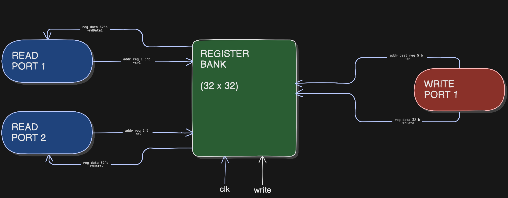

# 32x32 bit Register Bank

An array of 32 registers each 32 bit wide are implemented here in verilog to demonstrate a 'register bank'.   

-The module has clock synchronous write.  
-Two register for reading can simultaneuosly be accessed.  
-Only one register can be used to write data at a time at the clock edge.   

Following is a block diagram shows the different ports and i/o lines, exact names that have been used inside the code, along with their bit width. 

